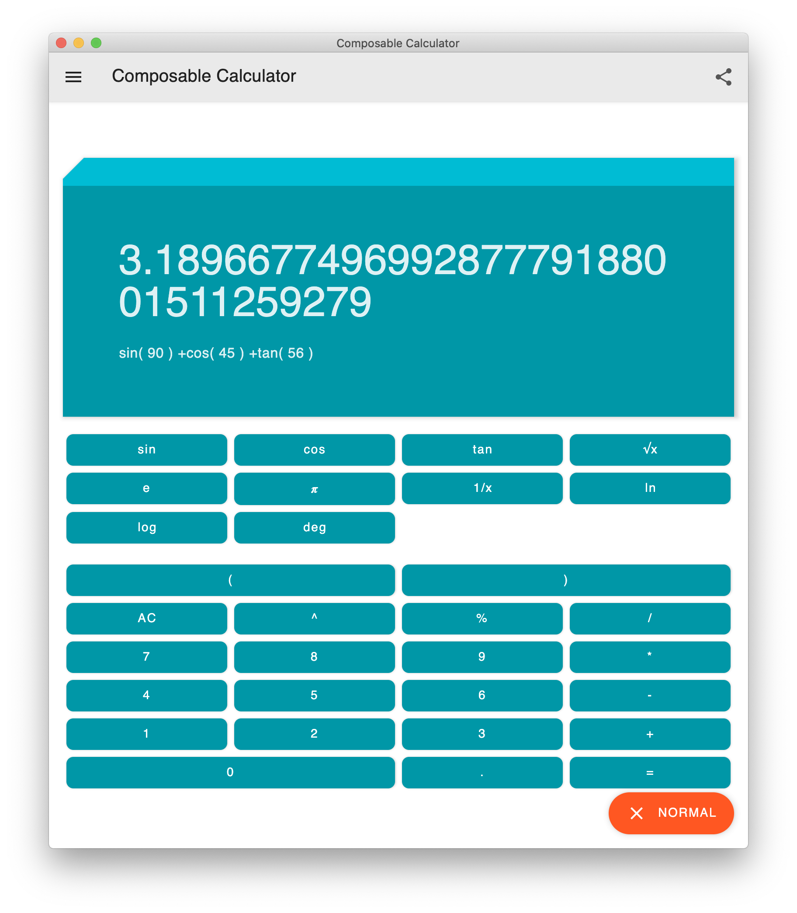

# A simple calculator

Supports calculations with add/sub/mul/div/exp/rem and parenthesis and several scientific operations.

The implementation made usage of Jetpack Compose for Desktop as UI library
and BetterParse as the parsing library.

Instead of implementation using double stack, which requires coding in imperative
mode, I have used the approach of parser combinator which makes code more declarative
and functional. In this way, the calculator is just something that remembers the user's input
into a store, and evaluate it at the moment the *calculate* button is pressed and put everything
onto the screen.

The error handling was done via the usage of Result class, I have taken it from the book
*The Joy of Kotlin*. However, the presentation of errors isn't great due to the limit of Compose
for Desktop (no banner, the dialog window will not wrap to the length of text, etc)

Besides, the components aren't adaptive at the vertical level, you might need to drag and drop the window
to resize its height to fit the components.

## Tech stack
- Language
    - Kotlin
- UI
    - Jetpack Compose
- Core Logic
    - Better Parse
    - BigMath
  
## Known issues

- If a calculation has encountered exception, the result will recorded as 0 in history
- Looks like the switch for deg/rad is not working at all
- Non auto-adaptive layout
- And lots of other bugs...